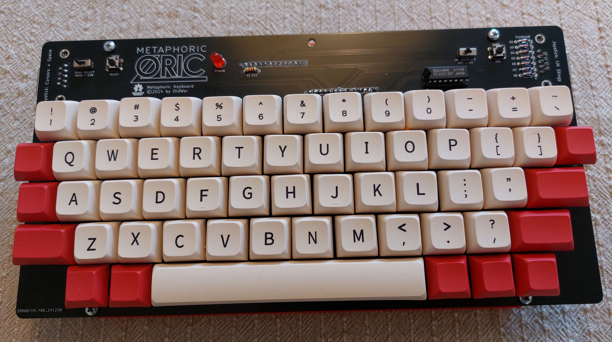
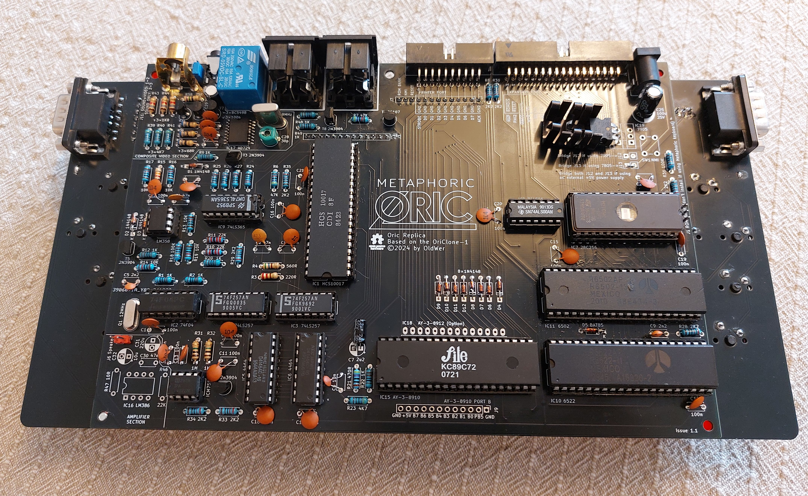
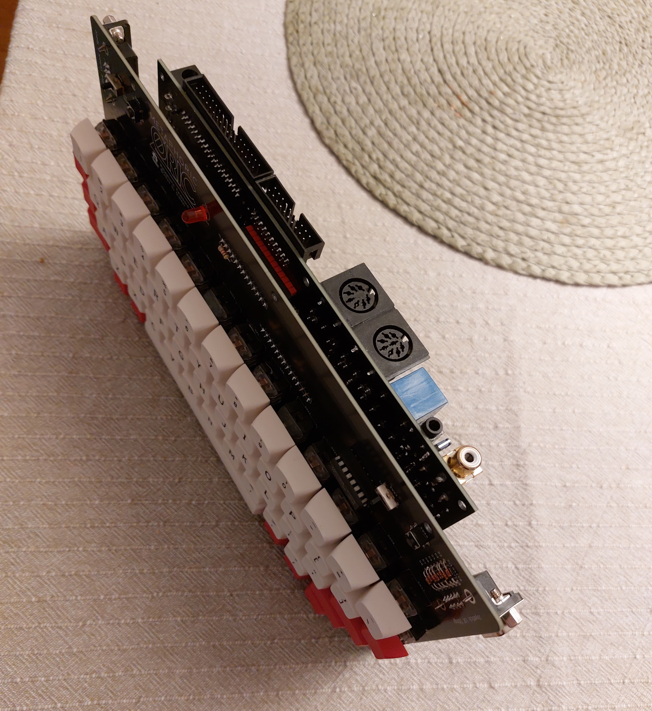
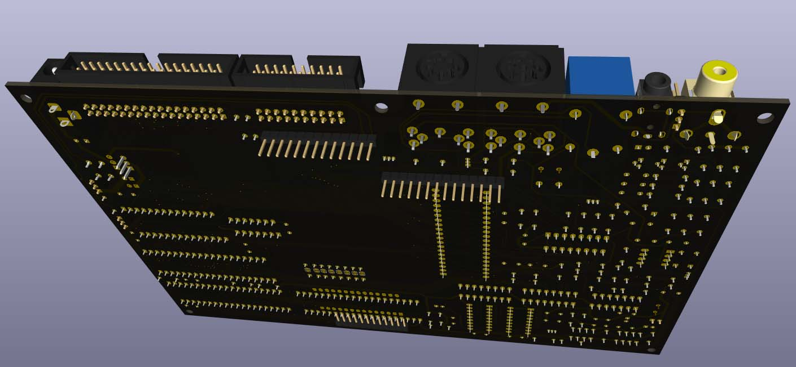
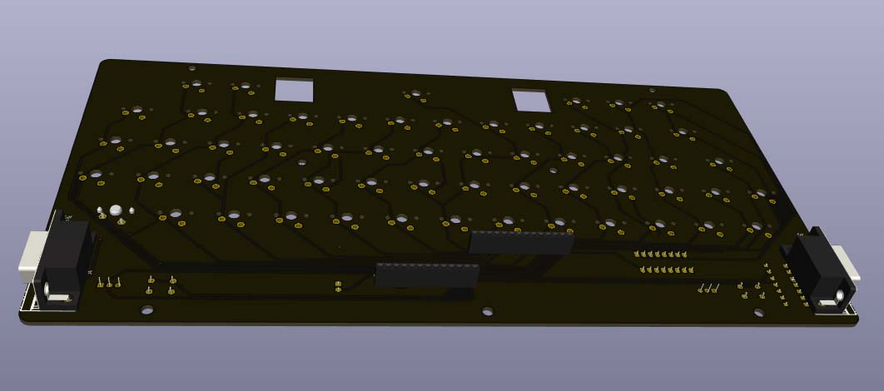
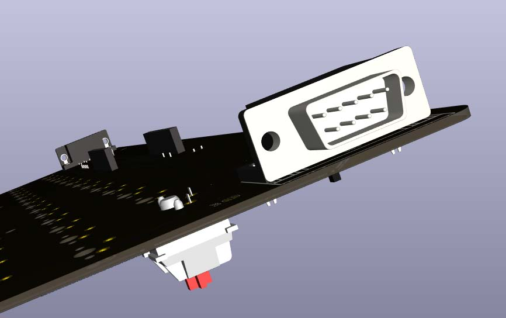

# Metaphoric - an enhanced Oric clone
Metaphoric is an Oric clone with the memory subsystem based on the OriClone-1 project and some additional features:
* Composite video output (RCA socket)
* TRRS audio-video socket for connecting "jack to 3xRCA" cable
* Footprints for both original AY-3-8912 chips and for (much cheaper) AY-3-8910 chips (or other 40-pin clones)
* Ability to use 7905 or 7805 power regulator and also to power the Metaphoric using an external +5V power supply
* Two Atari-standard joystick ports on the keyboard PCB — one is an IJK „Stingy” port, the other is a cursors+space joystick for games that do not support IJK but are controlled with cursors or make it possible to redefine the keys.
* Easily accessible RESET and NMI buttons on top of the keyboard.
* Easily accessible switches for changing the ROM between Oric-1 and Oric Atmos and for disabling the IJK interface (it may interfere with the operation of printer port and it can also corrupt sound in games that do not support IJK, e.g. Manic Miner)
* Automatic hardware V-sync hack - original Orics did not have any way of checking the vertical sync signal, which made it difficult to write games without flickering sprites, so somebody came up with the idea of connecting video sync signal to tape in using an external cable and synchronizing games/demos in that way. Metaphoric has a transistor that connects sync out to tape in when the tape relay is inactive and disconnects it when the relay is active (to allow loading from tape).

# Building the Metaphoric
Note: The main PCB fits in the original Oric-1/Atmos case (the keyboard PCB <i>does not</i>!). If you would like to use the main PCB with the original keyboard and case, do not install J10 (TRRS socket) and J7 (auxiliary connector that supports the additional switches on the keyboard).

The repository contains two directories with KiCAD projects for the main PCB and the keyboard PCB. The bill of materials is available in BOM.* files in the respective directories (in csv, xlsx and PDF formats). In the gerbers subdirectories there are gerber files ready for manufacturing (I used recommended JLCPCB settings when exporting the gerbers). In the main PCB's STL subdirectory there are 3D models for a simple case and also for a spacer which you can print in 5 copies and which is used to separate the two boards. In the keyboard's STL subdirectory thera is a 3D model for a holder that fits in the big square holes in the keyboard PCB and holds a typical space key stabilizer.

Most of the build is pretty self-explanatory, as all the components are described on the PCB. The things to watch for, in no particular order, are as follows:
1. You can omit all the parts in the 'COMPOSITE VIDEO SECTION' if you're only planning to use the RGB output (well, maybe except for the TRRS socket, which can also be used to output audio, and the J11 header). The file 'RGB_Scart_Tape.pdf' shows how to build a SCART cable, and this is definitely the recommended way of using an Oric, original or cloned.
2. Next to the composite RCA socket there is the J11 header. You can put jumper on pins 2-3 to use the nearby TRRS socket as an audio/video video out; there are ready-made 3,5mm jack-3 x RCA cables which you can use to output video and sound. Or you can put a jumper on pins 1-2 to use the TRRS socket as a regular 3,5mm stereo sound out, useful for connecting the Oric to a stereo system or an external speaker. 
3. You can omit all the parts in the "AMPLIFIER SECTION" if you're not going to use the internal speaker. Again, highly recommended to skip these components, they were only added for the sake of completeness, the sound quality is pretty terrible with the internal speaker and in some games there is no way to turn it off or to control volume.
4. The J1 header on the right side of the board can be used to switch the ROM bank, but if the main PCB is connected to the Metaphoric keyboard PCB, it <b>should not</b> be jumpered. There is a switch on the keyboard PCB that does the same, and because switching the banks means connecting either ground or +5V to one of the ROM address lines, if you leave the J1 jumpered and then connect the Metaphoric keyboard, in one of the two switch positions the +5V will get shorted to ground. So you can install the J1 e.g. for testing the main PCB or if it is to be used in the original Oric case, but before you connect it to the Metaphoric keyboard, <b>remember to take the jumper off!</b>
5. In the power section in the top right corner of the main PCB there are footprints for either 7905 or 7805 regulator. The 7905 is recommended only if you intend to use the Metaphoric with original Oric accessories, such as floppy drives (or modern recreations, such as Cumana Reborn). Modern solutions, such as Erebus or Loci, can be used with 7805 or an external +5V power supply. Depending on which regulator you choose, you must close one of the J12/J13 bridges. Close J12 (using a piece of wire, a diode leg will do) if using 7905, close J13 if using 7805. It is also possible to connect an external power switch across one of those bridges and use it to power the Metaphoric on and off. Another way to power the Metaphoric is to close both J12 and J13 bridges (without installing a regulator!) and use external +5V power supply, <b>center positive</b> (ground on the sleeve, +9V on the tip). I personally prefer this solution (no heat generated inside) and just use a USB power supply. If you decide to use a regulator, power the Metaphoric with a +9V power supply, <b>center positive</b>.
9. The main PCB and the keyboard PCB are connected using two pin headers - J3 and J7 on the main PCB, J1 and J2 on the keyboard PCB. Two male pin headers must be installed on the back of the main PCB, two female headers on the back of the keyboard PCB, and then the two boards must be connected back to back:

Then you should put 3D printed spacers between the two boards where the holes are and screw the boards to the case using M3x16 or M3x18 screws.

10. As for the keyboard, the joystick ports must be soldered on the back side of the PCB, like so:

11. There are also solder jumpers JP2 and JP3 that can be used to configure additional joystick buttons (eg. MSX, Amstrad CPC or Sega Master System/Amiga). There are some powered joysticks (e.g. with an autofire function) which are usually powered from the pin 7 of the DB9 port, and it probably wouldn't be a good idea to power them intermittently from the outputs of the VIA or the AY chip. If you'd like to use additional buttons, see the note in the keyboard schematic.

12. The spacebar stabilizer holder must be printed once in normal orientation (left) and once mirrored (right), because it is not exactly symmetrical. Then the holders must be pushed into the holes (some light sanding may be necessary), and finally the stabilizer itself must be glued to the holders with a tiny amount of glue (so as not to glue together the moving plastic parts).

If in doubt, open the relevant KiCAD PCB file and go to the 3D viewer; I've added 3D models for all the parts, creating some that I could not find anywhere, and you can check exactly how everything should look like.

If you have any questions, write to me at oldwer@op.pl, I will be happy to help.

Good luck soldering your own Oric!
